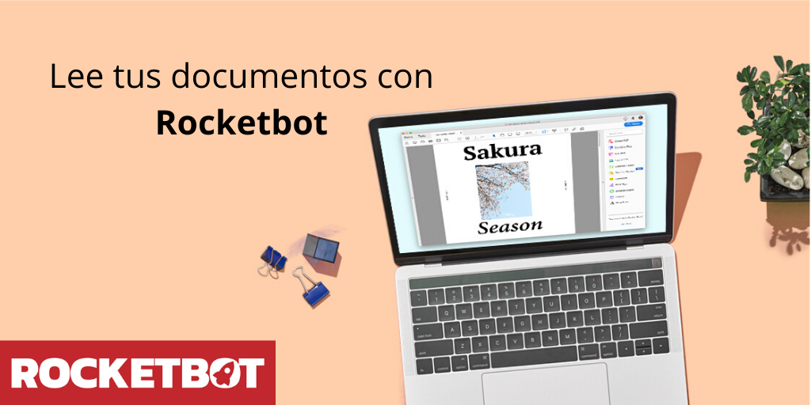

# Lector de documentos
  
Leé y extraé datos de archivos PDF y XPS  

*Read this in other languages: [English](Manual_DocReader.md), [Português](Manual_DocReader.pr.md), [Español](Manual_DocReader.es.md)*
  

## Como instalar este módulo
  
Para instalar el módulo en Rocketbot Studio, se puede hacer de dos formas:
1. Manual: __Descargar__ el archivo .zip y descomprimirlo en la carpeta modules. El nombre de la carpeta debe ser el mismo al del módulo y dentro debe tener los siguientes archivos y carpetas: \__init__.py, package.json, docs, example y libs. Si tiene abierta la aplicación, refresca el navegador para poder utilizar el nuevo modulo.
2. Automática: Al ingresar a Rocketbot Studio sobre el margen derecho encontrara la sección de **Addons**, seleccionar **Install Mods**, buscar el modulo deseado y presionar install.  

## Descripción de los comandos

### Leer documento (XPS o PDF)
  
Lee documento XPS y PDF
|Parámetros|Descripción|ejemplo|
| --- | --- | --- |
|Ruta del documento ||path/to/doc.pdf|
|Página||5|
|Opción|||
|Variable donde se guardará el texto||result|

### Leer PDF
  
Lee documentos PDF
|Parámetros|Descripción|ejemplo|
| --- | --- | --- |
|Ruta del documento ||path/to/doc.pdf|
|Variable donde se guardará el texto||result|
